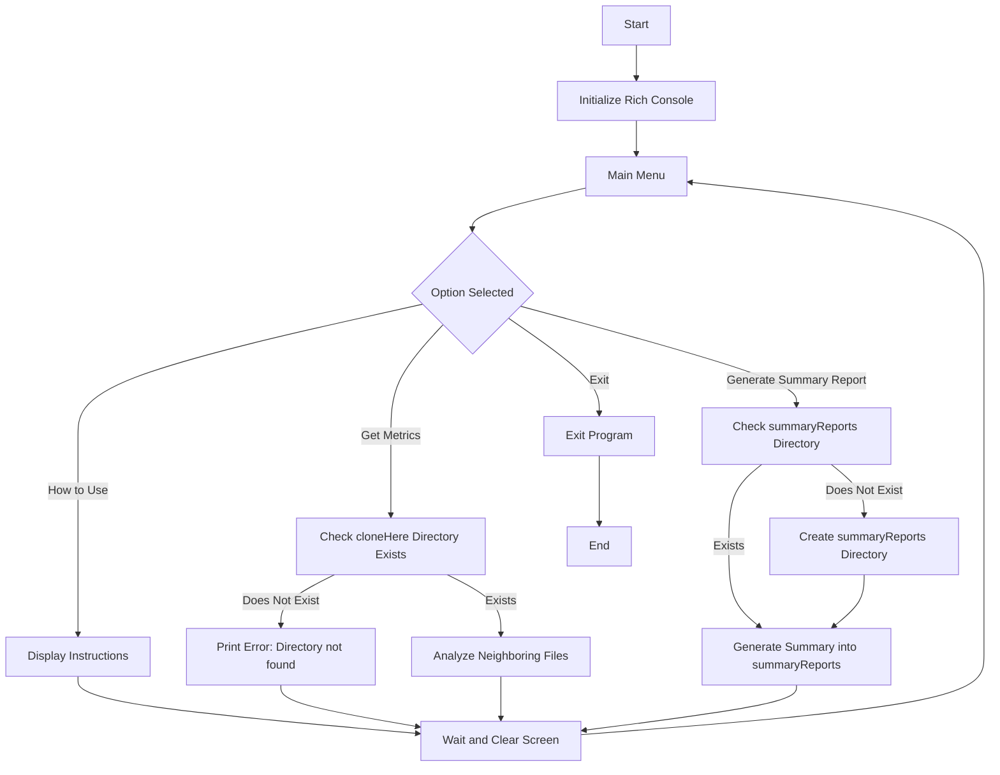

# CodeMetrics Terminal Tool (CMTT)

The CodeMetrics Terminal Tool (CMTT) is a Python-based software metrics analysis tool designed to provide software developers and project managers with immediate insights into code quality directly from the terminal. 

## Objective

CMTT aims to offer quick assessments of software quality metrics such as Lines of Code (LOC), Cyclomatic Complexity, Code Coverage, and Defect Density. It allows users to analyze codebases and identify areas for improvement.

## Features

- **Terminal-based:** Operates directly from the terminal for swift and easy access.
- **Metric Collection:** Collects and analyzes essential software metrics including LOC, Cyclomatic Complexity, Code Coverage, and Defect Density.
- **Expandability:** Designed with future integration of additional metrics and a Graphical User Interface (GUI) in mind.
- **Neighboring File Analysis:** Monitors a designated folder (`cloneHere`) for Python files, automatically analyzing any new files for metrics.
- **(Coming Soon) Defect Tracking Integration:** Integrates with bug tracking systems like JIRA, Bugzilla, or GitHub Issues to fetch defect data for analyzed files, enhancing the defect density calculations.
- **Summary Reporting:** Generates detailed summary reports in `summaryReports` folder, providing actionable insights and suggestions based on analyzed metrics.

## Getting Started

1. Clone the repository to your local machine.
2. Install the required dependencies with `pip install -r requirements.txt`.
3. Execute `python main.py` to start monitoring the designated folder.
4. Drop Python files into the monitored folder `cloneHere` for automatic analysis.
5. Review the generated reports in the `summaryReports` directory for insights and improvements.

## Dependencies

Ensure you have Python 3.x installed and then install project dependencies:pip install -r requirements.txt

## Flowchart

## Contributing

Contributions to enhance the tool or add new features are welcome! Please fork the repository, make your changes, and submit a pull request.

## License

This project is licensed under the MIT License - see the [LICENSE](LICENSE) file for details.

